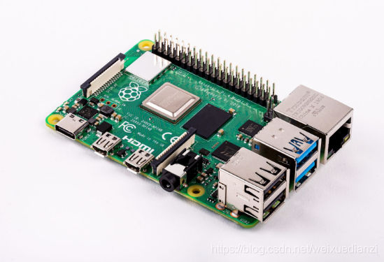

# Raspberry PI 4 SDK

## 1. 简介

这份 SDK 包含 RT-Thread 团队针对 Raspberry Pi 4 系统搭建的板级支持包(BSP) , 以及 Google 的 Tensorflow Lite Micro 嵌入式深度学习推理框架. 基于 SDK 的功能, 可以实现在Raspberry Pi 4平台中部署基于Tensorflow Lite框架训练的深度学习任务.



目前Raspberry Pi 4对应的硬件特性：

| 硬件    | 描述                            |
| ------- | ------------------------------- |
| CPU     | quad-core 64-bit ARM Cortex-A72 |
| 主频    | 1.5 GHz                         |
| GPU     | VideoCore IV                    |
| GPU频率 | 400MHz                          |
| Memory  | 1GB, 2GB, 4GB LPDDR4 SDRAM      |

外设支持上，引入了双频Wi-Fi，蓝牙5.0，千兆网卡，MIPI CSI相机接口，两个USB口，40个扩展帧。

硬件引脚分布情况:


## 2. 目录结构

```
$ raspi4-tfliteMicro
├── documents
│   ├── figures
│   └── TFLu
├── project
│   └── raspi_pi_audio --> 内含基于TFLu的语音识别示例
├── README.md
└── rt-thread
```

- documents
  图片和Tensorflow Lite Micro软件包的有关文档
  
- projects
  示例工程文件夹，目前包含Tensorflow Lite Micro的语音示例
  
- READM.md
  工程说明README.md文档
  
- rt-thread
  rt-thread 源码

## 3. 编译说明

Linux下推荐使用[gcc工具][2]。Linux版本下gcc版本可采用`gcc-arm-8.3-2019.03-x86_64-aarch64-elf`工具。此处以raspi_pi_audio工程为例. 

- 将工具链解压到如下的指定目录, 并在project文件夹下选择想要执行的示例文件夹,  修改`raspi_pi_audio/rtconfig.py` 的`EXEC_PATH`为自定义gcc目录, 如下例所示.

```
PLATFORM    = 'gcc'
EXEC_PATH   = r'/opt/gcc-arm-8.3-2019.03-x86_64-aarch64-elf/bin/'  
```

- 以linux系统为例, 终端进入`path_of_SDK/project/raspi_pi_audio/`目录，输入 scons --menuconfig 对工程进行配置。

```
RT-Thread online packages  --->
	miscellaneous packages  --->
		Tensorflow Lite Micro: a lightweight deep learning end-test inference framework for RT-Thread operating s
			Version (latest)  --->  
			Select Offical Example (Enable Tensorflow Lite Micro audio example)  --->      
            Select Tensorflow Lite Operations Type (Using Tensorflow Lite reference operations)  ---> 
```

Select Offical Example中有三个选项:

```
(X) Enable Tensorflow Lite Micro audio example 
( ) No Tensorflow Lite Micro Example 
```

注 : audio example是执行官方携带的语音示例, No example则是不集成example文件, 只使用Tensorflow Lite Micro标准框架. 

Select Tensorflow Lite Operations Type中有两个选项:

```
(X) Using Tensorflow Lite reference operations
( ) Using Tensorflow Lite CMSIS NN operations 
```

注 : reference operation是应用TFLMicro的通用算子(算子与平台隔离,可移植性好),  CMSIS NN operations是应用针对ARM平台进行特定优化的算子(主要针对Cortex M4内核以上的平台, 对该平台有特定加速优化).

- 在终端输入scons进行编译, 即可生成携带TFLu的rtthtread.bin和rtthread.elf

## 4. 执行

### 4.1 下载**Raspberry Pi Imager**，生成可以运行的raspbian SD卡

首先下载镜像

* [Raspberry Pi Imager for Ubuntu](https://downloads.raspberrypi.org/imager/imager_amd64.deb)
* [Raspberry Pi Imager for Windows](https://downloads.raspberrypi.org/imager/imager.exe)
* [Raspberry Pi Imager for macOS](https://downloads.raspberrypi.org/imager/imager.dmg)

### 4.2 准备好串口线

目前版本是使用raspi4的 GPIO 14, GPIO 15来作路口输出，连线情况如下图所示：


串口参数： 115200 8N1 ，硬件和软件流控为关。

### 4.3 程序下载

当编译生成了rtthread.bin文件后，我们可以将该文件放到sd卡上，并修改sd卡中的`config.txt`文件如下：

```
enable_uart=1
arm_64bit=1
kernel=rtthread.bin
```

按上面的方法做好SD卡后，插入树莓派4.

如果在 menuconfig 中选择的是 audio example, 则在上电之后可以在串口上看到如下所示的输出信息：

```text
heap: 0x000c9350 - 0x040c9350

 \ | /
- RT -     Thread Operating System
 / | \     4.0.3 build Apr 16 2020
 2006 - 2020 Copyright by rt-thread team
 model load successfully!!
 Heard yes (203) @1400ms
 Heard yes (201) @9400ms
 Heard yes (201) @17400ms
 Heard yes (201) @25400ms
 ...
```

此时工程执行的是 raspi_pi_audio 目录下 applications 中的`audio_main.cc` 中的`main`函数, 工程实现了官方自带语音模型, 识别示例语音文件中的yes和no关键字. 

如果在 menuconfig 中选择的是 No example, 则在上电之后可以在串口上看到如下所示的输出信息：

```text
heap: 0x000c9350 - 0x040c9350

 \ | /
- RT -     Thread Operating System
 / | \     4.0.3 build Apr 16 2020
 2006 - 2020 Copyright by rt-thread team
msh>
```

此时工程执行的是根目录下`Application `中的`main.cc` 中的`main`函数, 此时工程默认不产生任何输出, 需要用户自行设计

## 5. 注意事项

- 目前的CMSIS库中对于TFLu的算子优化有部分集中在Cortex M的内核中, 对应的Cortex A内核可能无法实现优化, 此时可以采用reference算子
- 目前CMSIS NN算子还处在测试阶段, 可能存在问题. 
- 本SDK对应了一个与硬件平台隔离的软件包TensorFlow Lite Micro, 详细请见仓库链接: https://github.com/QingChuanWS/TensorflowLiteMicro

## 6. 支持情况

| 驱动 | 支持情况  |  备注  |
| ------ | ----  | :------:  |
| UART | 支持 | UART0|

## 6. 联系人信息

维护人：[bernard][5]  [QingChuanWS][7]

[1]: https://www.rt-thread.org/page/download.html
[2]: https://developer.arm.com/tools-and-software/open-source-software/developer-tools/gnu-toolchain/gnu-a/downloads
[3]: https://downloads.raspberrypi.org/raspbian_lite_latest
[4]: https://etcher.io
[5]: https://github.com/BernardXiong
[6]:https://tensorflow.google.cn/lite/microcontrollers
[7]:https://github.com/QingChuanWS/raspi4-tfliteMicro

